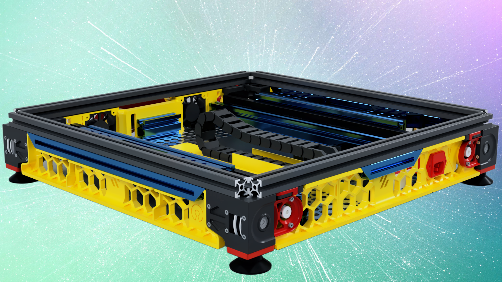
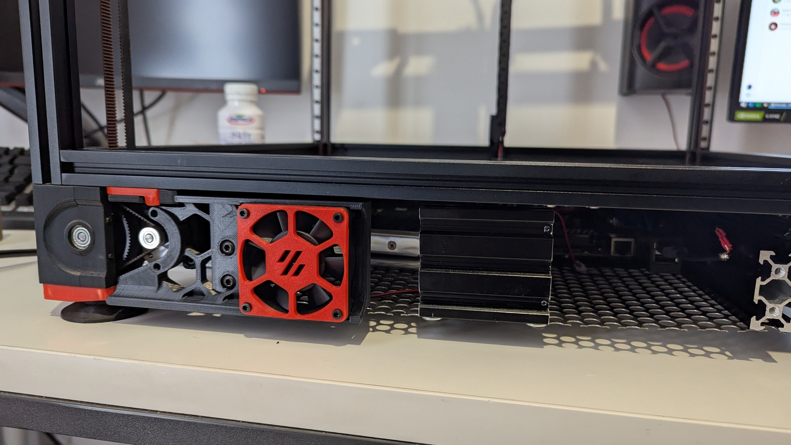

  

<b>A drawer mod for the Voron 2.4's electronic components (350mm only)</b>

 

<table>
<tr>
<td width=50%>
<td>
This is a personal project I’ve been working on for a while during my first Voron 2.4 build. I also have a heavily modified Sidewinder X2 printer, where easy access to electronics was my top priority during upgrades. With that in mind, I took the same approach when working on my Voron 2.4. This modification has already proven to be highly useful and convenient, as it has allowed me to quickly access and rectify certain issues as they arise.

</table>

## Table of Content
  
**[BOM](#bom)** 
**[STL](#stl)** 
**[CAD](#cad)** 
**[Credits](#credits)** 
**[Changelog](#changelog)** 
**[Build Photos](#build-photos)** 

 

## BOM
<table>
<tr>
<td width=50%></td>
<td>
<b>Things you will need:</b> 
  - Drawer Runners 450mm (18") 
  - x56 M5x8 BHCS 
  - x10 M5x6 BHCS 
  - x62 M5 Spring T-Nuts 
<b>Extrusions:</b> 
  - x2 2020 335mm 
  - x1 2020 90mm 
  - x4 2060 50mm 
  - x2 2040 300mm 
  - x2 2040 467mm (threaded one side) 
  - x1 2020 261 
  - x1 2040 75mm (for BTT HDMI5 Mount) 
  - x24 90 Degree Angle Corner (at least x6 must be like this below): 
    https://ooznest.co.uk/product/90-degree-angle-corner/ 
<b>Other:</b> 
  - x6 WAGO (5way) 
  - 467x302 tray (Mesh or Solid) 
  - Drag Chain (not wider than 38mm - I used 10x30mm) 
</td>
</tr>

</table>

 

## STL
I have modified the necessary models, such as the skirting, to ensure they fit the modification properly. Additionally, I have designed and created new models as needed to facilitate the project's progress. These include an adapter for the Manta M8P board, slightly modified WAGO shelves to better suit the updated design, and a refined BTT HDMI 5" mount for improved compatibility. Each modification was made to enhance functionality, optimize integration, and ensure seamless assembly within the updated setup 
I recommend to print those parts with the same settings as Voron parts. I have used ASA for mine, therefore I'd recommend to use ABS/ASA.

 

## CAD
<table>
<tr>
<td>
I have created a CAD model for reference purposes only, allowing you to understand its construction, visualize its design, and see how it functions. While it is not intended for direct use, it provides a detailed overview of the mod’s structure and mechanics

[Take me to it!](CAD)
</td>
<td width=30%>
<td width=30%>
</tr>
</table>

YELLOW components need printing as they are either new or modified.

BLUE components need purchasing if you don't have them.

RED components are stock models that don't require re-printing or purchasing.

 

 

## Credits
<ul>
  <li> Many thanks to @EDnation at (https://www.printables.com/@EDnation) for sharing his BTT HDMI5" v1.2 mount at https://www.printables.com/model/926845-btt-hdmi5-v12-display-mount-voron . I have modified one part to fit this modification.</li> 
</ul>

## Changelog
<ul>
  <li>v1.0 - Initial Release (Enjoy!)
</ul>

 

## Build Photos
<td width=30%></td>

